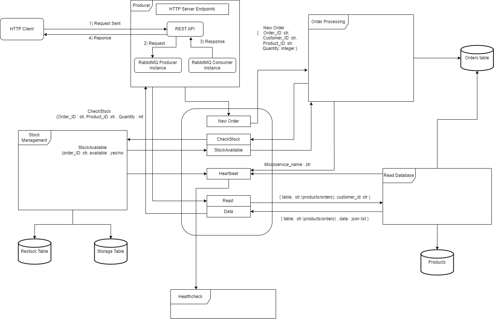
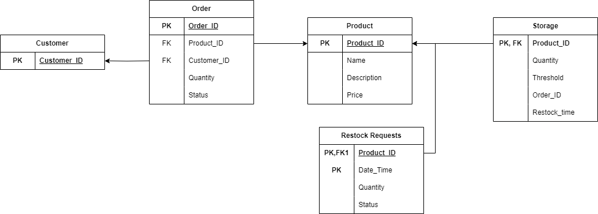

# Microservices Communication Using RabbitMQ

## Project Description

This project was developed as a part of the Semester 6 - Cloud Computing course at PES University.

This project aims to develop an inventory management system using a microservices architecture. The system efficiently manages inventory items, tracks stock levels, and handles orders through independent and scalable microservices. RabbitMQ is utilized for inter-service communication, ensuring reliable message passing, and Docker is used for containerization, facilitating scalability, modularity, and ease of deployment.

## High Level Design



## Database Design



## Setup Instructions

To set up and run the inventory management system on your local machine, follow these steps:

### Prerequisites

- Docker: Ensure Docker is installed on your system.

### Clone the Repository

Clone the repository to your local machine using Git:

```bash
git clone <repository-url>
cd <repository-directory>
```

### Build and Run Docker Containers

```bash
cd backend
docker-compose build
docker-compose up
```

### Accessing the Application

To interact with the inventory management system, a basic Node.js client `basic_client.js` has been provided. Follow these steps to run the client and access the application:

1. Ensure you have Node.js installed on your system.
2. Install the required dependencies for the Node.js client:
   ```bash
   npm install
   ```
4. Run the Node.js client:
   ```bash
   node basic_client.js
   ```
5. Follow the prompts to login, place orders, display products, view orders, and logout.

#### Node.js Client Endpoints

The Node.js client interacts with the following endpoints of the inventory management system:

* **Orders Endpoint:** `GET/POST http://localhost:8080/orders`
* **Login Endpoint:** `POST http://localhost:8080/login`

Ensure that the inventory management system Docker containers are running and accessible at `http://localhost:8080` before running the Node.js client.

## Contributors

- Gayathri Manoj ([@GayathriManoj2003](https://github.com/GayathriManoj2003))
- R.S. Moumitha ([@Moumitha120104](https://github.com/Moumitha120104))
- Sai Manasa Nadimpalli ([@Mana120](https://github.com/Mana120))
- Shreya Kashyap ([@Shreya241103](https://github.com/shreya241103))
